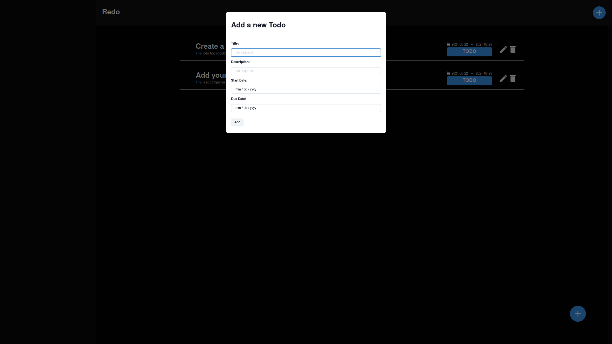

# Redo

## **!! Application still under development !!**

you can find this app **live** [here](https://redo.vercel.app/)

#### This is a a todo application build with ReactJS using NextJS and Redux.

#### You might be wondering why this name **Redo**, because all of its logic is built using **Redux**, do because it is a todo list app.

## Purpose

This is application is being build for the mastering of the **Redux State Management** library.

## App Features

- Create Todos
- Get Todos
- Update Todos
- Delete Todos

## Technologies Used

- NextJS (ReactJS)
- Redux
- Jest
- Chakra-UI